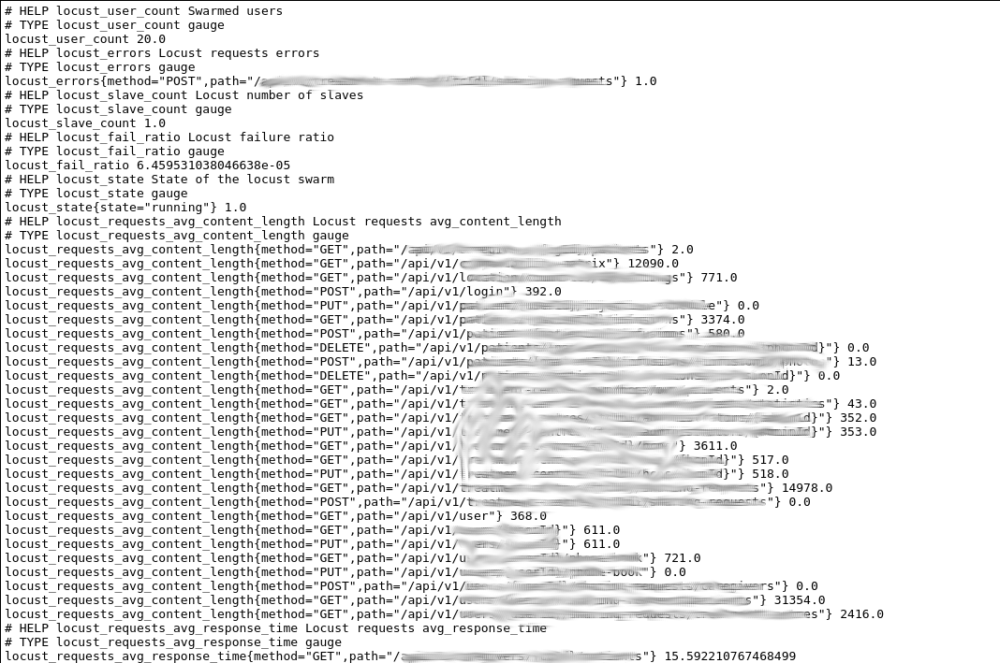

# Prometheus Metrics Exporter for Locust

A locust exporter for prometheus, forked from [mbolek/locust_exporter](https://github.com/mbolek/locust_exporter)

This is a simple exporter for http://locust.io metrics.
You get all the necessary details about current tests and the state of the locust.

Errors and requests stats are added with the method and path labels - BE CAREFUL - if you have a lot of endpoints.
It is probably better to group the endpoints in your locustfile (please
see: http://docs.locust.io/en/latest/writing-a-locustfile.html#grouping-requests-to-urls-with-dynamic-parameters).

## Setup

This project uses [UV](https://docs.astral.sh/uv/).

- Install uv
- run `uv sync`
- You can now `uv run locust_exporter.py <listen_port> <locust_host:port>`

## Usage

Run the exporter with:

`./locust_exporter.py`

## Configuration

| Environment Variable | Description                          | Default                 |
|:---------------------|:-------------------------------------|:------------------------|
| `LOCUST_URI`         | The locust address to connect to     | `http://localhost:8089` |
| `LISTEN_PORT`        | The port the exporter will listen on | `8088`                  |

## Acknowledgements

This project is forked from [mbolek/locust_exporter](https://github.com/mbolek/locust_exporter)

Includes cherry-picked contributions to the original project:
- [rewrite to more modern client_python version](https://github.com/nobusugi246/locust-exporter/commit/a08cbe780ce4511ba234775ad219e30aedd6fe5a#diff-84efe67fd91a0d0c078d0ca120f5537bf4b12c7ba424e68329d5354df438be47R52) from [nobusugi246](https://github.com/nobusugi246).
- [percentiles](https://github.com/dduleba/locust_exporter/commit/ec709fdd8c6791476ee6891748d1aa48b658d0de) from [dduleba](https://github.com/dduleba).
- [fix for locust 0.12.2](https://github.com/lrouquette/locust_exporter/commit/1a575c691278787176688ef4edf6deb9b4b0df32) from [lrouquette](https://github.com/lrouquette).
